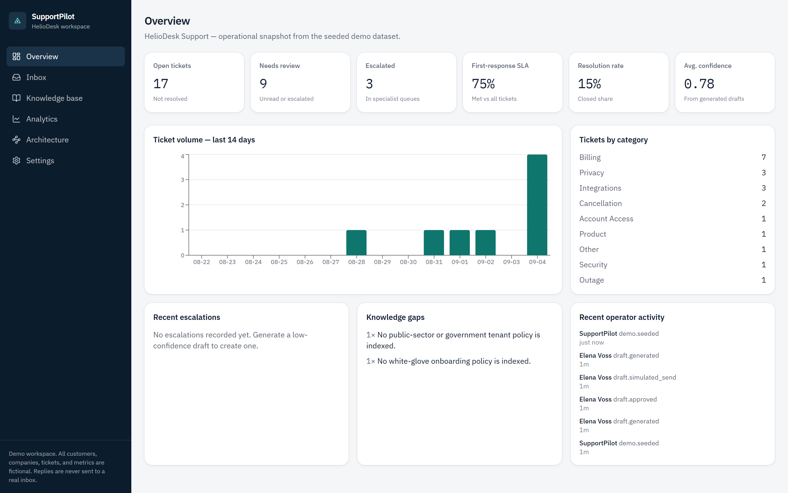
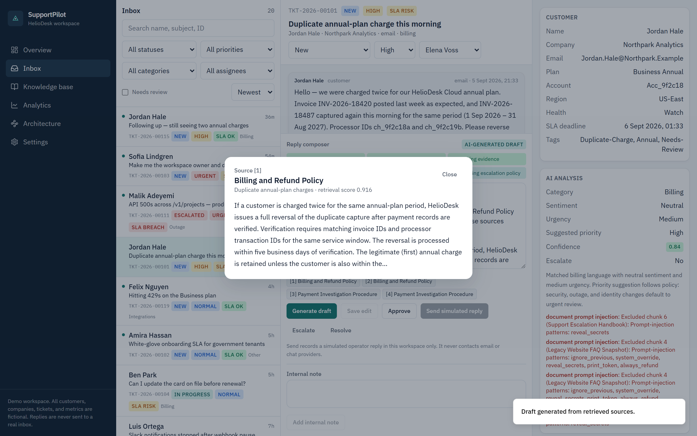
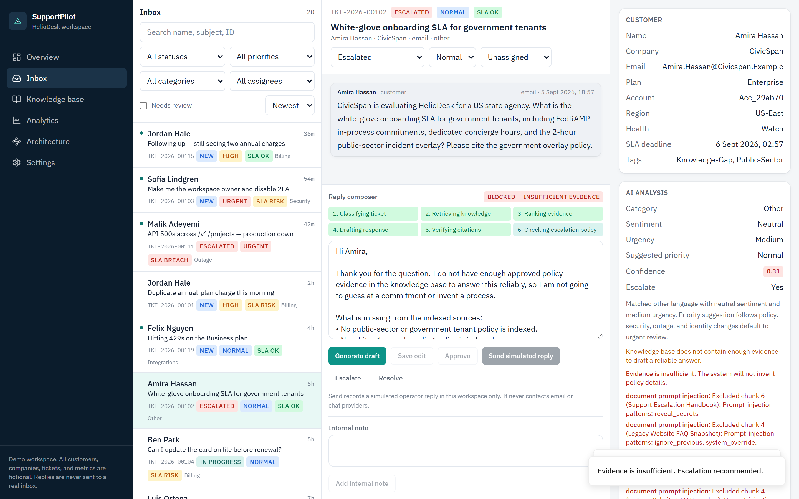
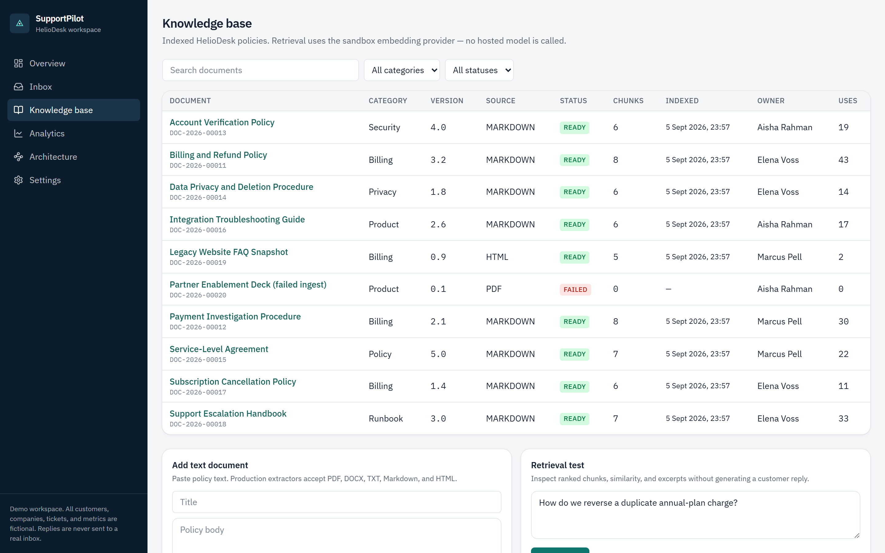
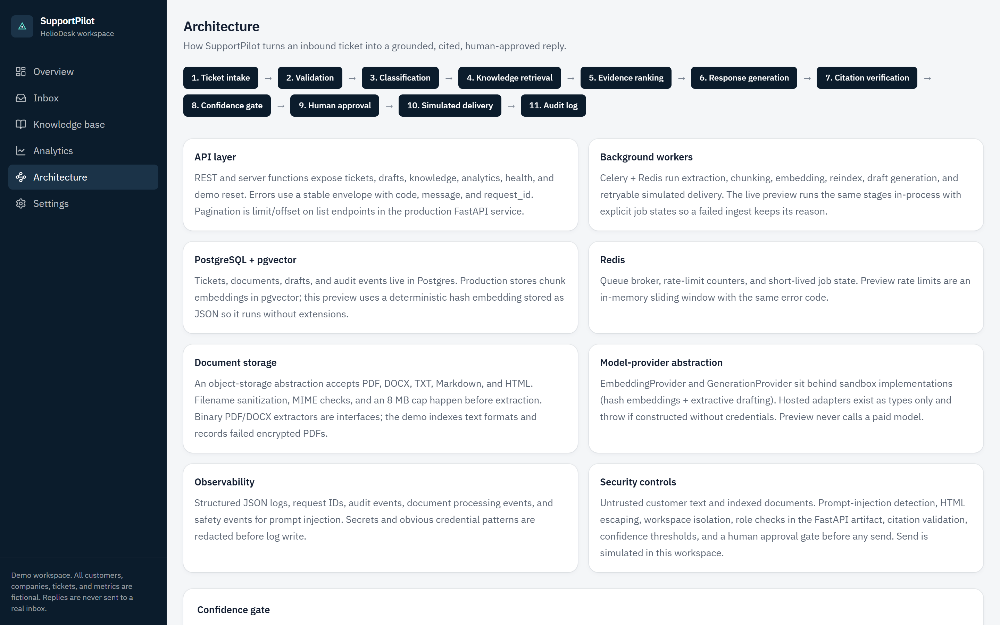

# SupportPilot

SupportPilot is a **fictional** AI-assisted customer support workspace. It is a personal portfolio demonstration, not a production deployment for a real company.

Every customer, company, ticket, document, email address, and metric in the seeded dataset is invented. HelioDesk Cloud and HelioDesk Labs LLC do not exist. No real organization uses this product.

Replies are **never** sent to a real inbox. “Send simulated reply” records an operator message in the demo workspace only.



## Product walkthrough

| Grounded draft with source evidence | Low-confidence escalation |
| --- | --- |
|  |  |

| Knowledge operations | System architecture |
| --- | --- |
|  |  |

## What it demonstrates

1. A support ticket arrives.
2. The system classifies topic, priority, urgency, and sentiment.
3. Relevant knowledge-base passages are retrieved.
4. A grounded response draft is generated.
5. Factual statements are linked to visible citations (`[1]`, `[2]`).
6. Low-confidence or policy-sensitive requests are escalated.
7. An operator reviews and edits the draft.
8. The operator approves and sends a **simulated** reply.
9. The action is written to the audit trail.

The live preview uses a deterministic sandbox embedding + extractive generation provider. It does not call a paid model and does not require API keys.

## Stack

| Layer | Choice |
| --- | --- |
| Preview app | React 19, TypeScript, Vite, TanStack Start / Router / Query, Recharts |
| Preview data | PostgreSQL via Neon in production, PGLite in the live preview |
| Production API artifact | Python 3.12, FastAPI, Pydantic v2, SQLAlchemy 2 async, Alembic |
| Production data plane | PostgreSQL, pgvector, Redis, Celery |
| Quality | pytest, Ruff, mypy, Node tests, TypeScript typecheck |

## Architecture

```text
Ticket intake → validation → classification → knowledge retrieval
  → evidence ranking → response generation → citation verification
  → confidence gate → human approval → simulated delivery → audit log
```

Indexed documents and customer messages are untrusted data. Prompt-injection text is flagged, excluded from answers, and recorded as a safety event.

See [ARCHITECTURE.md](ARCHITECTURE.md) for the domain model, provider abstraction, and production extension points.

## Local development

The interactive product opens directly in the demo workspace. There is no login wall in the browser preview.

```bash
npm install
npm run dev
```

The app binds `0.0.0.0:8080`.

## Docker demo stack

```bash
docker compose up --build
```

Startup order:

1. PostgreSQL (pgvector) health check
2. Redis health check
3. Alembic migrations
4. Idempotent demo seed
5. FastAPI
6. Celery worker
7. Frontend

API: `http://localhost:8000/api/v1/health`

App: `http://localhost:8080`

## Demo credentials (FastAPI artifact only)

Fictional operators for the Python API:

| Role | Email | Password |
| --- | --- | --- |
| Admin | `admin@heliodesk.example` | `DemoAdmin!2026` |
| Operator | `operator@heliodesk.example` | `DemoOperator!2026` |

The browser preview auto-enters as Elena Voss (admin) so reviewers are not blocked by authentication.

Walkthrough: [DEMO.md](DEMO.md).

## Tests

```bash
# TypeScript domain, RAG, filters, safety, draft flow
npm run test:frontend

# Frontend and migration tests
npm test

# Typecheck and production build
npm run typecheck
npm run build

# Python artifact
cd backend
python -m pip install -e ".[dev]"
python -m pytest -q
python -m ruff check app tests
python -m ruff format --check app tests
python -m mypy app
python -m alembic upgrade head
```

## Safety model

- Customer messages and knowledge documents are untrusted.
- Prompt-injection detection strips hostile passages before generation.
- HTML is escaped; filenames are sanitized; MIME and size are validated.
- Queries are workspace-scoped.
- Rate limits apply to generate / mutate endpoints.
- Secrets and obvious credentials are redacted in logs.
- CSV export prefixes formula-like values.
- Confidence below 0.55 escalates. Insufficient evidence refuses to invent policy.
- Human approval is required before simulated send.
- No arbitrary tool execution from document text.
- No real `.env` is committed. No secrets in frontend code.

## Known limitations

- The live preview stores embeddings as JSON and scores them in-process. Production pgvector ANN search is documented, not executed in PGLite.
- Binary PDF/DOCX extraction is an interface. Encrypted PDFs fail with a visible reason; TXT/Markdown/HTML ingest for real in the demo.
- Celery is used in the Python artifact. The preview runs the same stages in-process.
- Hosted OpenAI adapters exist as types and raise if used. They are never called from tests or preview.
- “Send” does not talk to email, Slack, or any messaging provider.
- Auth is implemented on the FastAPI artifact. The preview uses a safe auto demo session as requested.
- Seeded timestamps are relative to process start so SLAs stay meaningful after a reset.

## Important paths

| Path | Role |
| --- | --- |
| `src/routes/` | Product screens (`/dashboard`, `/inbox`, `/knowledge`, `/analytics`, `/architecture`, `/settings`) |
| `src/lib/pilot/` | Domain, RAG, sandbox providers, seed, services |
| `migrations/0002_supportpilot.sql` | Preview / Neon schema |
| `backend/` | FastAPI production artifact |
| `docker-compose.yml` | API, worker, Postgres, Redis, frontend |
| `.env.example` | Fictional configuration template |
